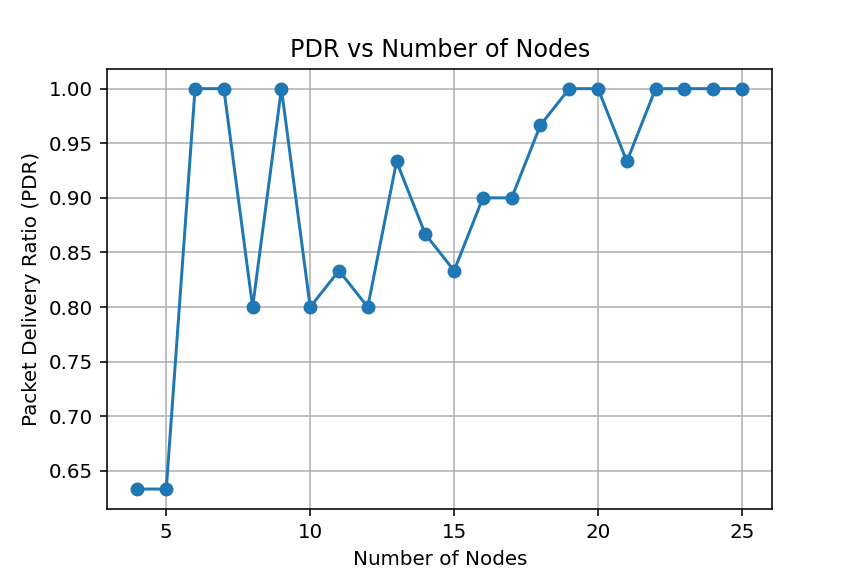
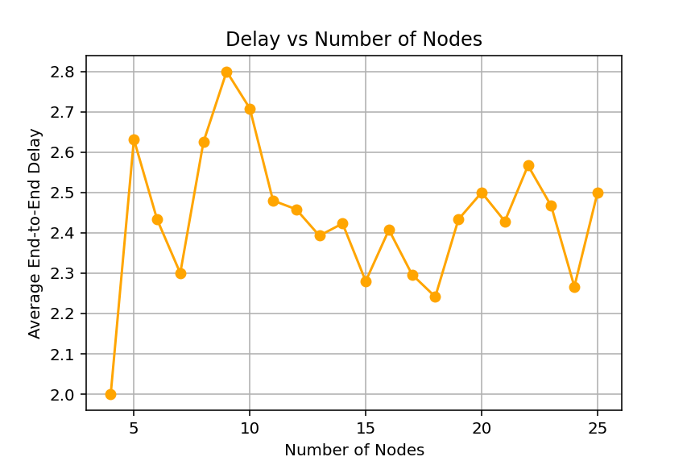
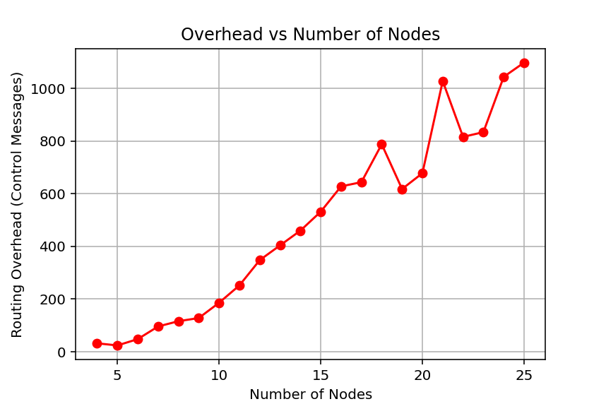
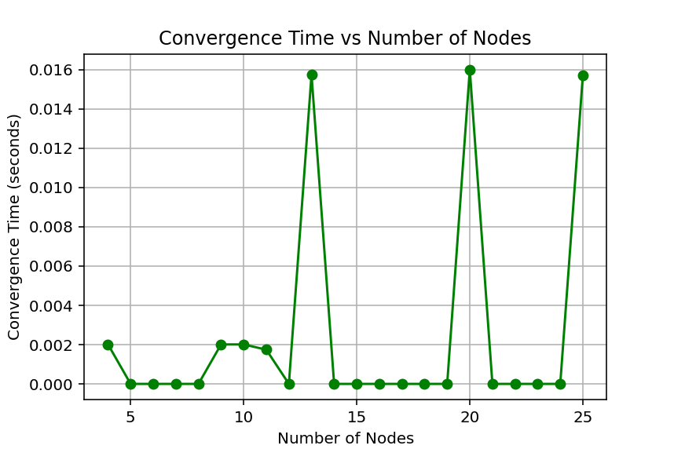

 DSDV Routing Protocol Simulation using Python

This project simulates the Destination-Sequenced Distance Vector (DSDV) routing protocol — a key protocol in Mobile Ad Hoc Networks (MANETs).  
The simulation models, how nodes in a wireless network maintain and update routing information, how they react to link failures, and how network performance changes as the number of nodes increases.

---

 Overview

Routing is an essential part of any network. In traditional wired networks, routers have stable connections.  
But in ad hoc wireless networks, nodes can move, and links can break frequently ,which makes dynamic routing protocols necessary.

The DSDV protocol is a proactive routing protocol(table-driven) that continuously maintains up-to-date routing information at each node using periodic broadcasts and sequence numbers to avoid routing loops.

This project:
- Simulates the behavior of the DSDV routing algorithm.
- Models how routing tables are updated after link failures.
- Calculates performance metrics such as:
  - Packet Delivery Ratio (PDR)
  - Average End-to-End Delay
  - Routing Overhead
  - Convergence Time
- Plots graphs to visualize network performance as the number of nodes increases.

---

 How DSDV Works (Concept Summary)

1. Each node maintains a routing table containing:
   - Destination node ID  
   - Next hop node  
   - Hop count (number of intermediate nodes)  
   - Sequence number (to ensure freshness)

2. Periodic Updates:  
   Nodes share their routing tables with their neighbors to maintain consistency.

3. Link Failure Handling:  
   If a connection between two nodes breaks, the affected route is invalidated, and sequence numbers are increased to indicate route updates.

4. Convergence:  
   The network reaches a stable state when all routing tables are updated with the most recent, loop-free routes.

 Project Structure

Below is the structure of the DSDV Simulation project:

DSDV_Simulation
│
├── dsdv_simulation.py # Main Python file containing all simulation code
├── README.md # Project explanation and documentation
├── PDR_vs_Nodes.png # Graph: Packet Delivery Ratio vs Number of Nodes
├── Delay_vs_Nodes.png # Graph: Average End-to-End Delay vs Number of Nodes
├── Overhead_vs_Nodes.png # Graph: Routing Overhead vs Number of Nodes
├── Convergence_vs_Nodes.png # Graph: Convergence Time vs Number of Nodes
├── DSDV_Report.pdf # Your academic project report

Output Example

Nodes=4: {'pdr': 0.6333333333333333, 'delay': 2.0, 'overhead': 32, 'convergence': 0.002013683319091797}
Nodes=5: {'pdr': 0.6333333333333333, 'delay': 2.6315789473684212, 'overhead': 24, 'convergence': 0.0}
Nodes=6: {'pdr': 1.0, 'delay': 2.433333333333333, 'overhead': 48, 'convergence': 0.0}
Nodes=7: {'pdr': 1.0, 'delay': 2.3, 'overhead': 96, 'convergence': 0.0}
Nodes=8: {'pdr': 0.8, 'delay': 2.625, 'overhead': 116, 'convergence': 0.0}
Nodes=9: {'pdr': 1.0, 'delay': 2.8, 'overhead': 128, 'convergence': 0.0020105838775634766}
Nodes=10: {'pdr': 0.8, 'delay': 2.7083333333333335, 'overhead': 186, 'convergence': 0.002009868621826172}
Nodes=11: {'pdr': 0.8333333333333334, 'delay': 2.48, 'overhead': 252, 'convergence': 0.0017435550689697266}
Nodes=12: {'pdr': 0.8, 'delay': 2.4583333333333335, 'overhead': 348, 'convergence': 0.0}
Nodes=13: {'pdr': 0.9333333333333333, 'delay': 2.392857142857143, 'overhead': 404, 'convergence': 0.015750408172607422}
Nodes=14: {'pdr': 0.8666666666666667, 'delay': 2.423076923076923, 'overhead': 460, 'convergence': 0.0}
Nodes=15: {'pdr': 0.8333333333333334, 'delay': 2.28, 'overhead': 532, 'convergence': 0.0}
Nodes=16: {'pdr': 0.9, 'delay': 2.4074074074074074, 'overhead': 628, 'convergence': 0.0}
Nodes=17: {'pdr': 0.9, 'delay': 2.2962962962962963, 'overhead': 644, 'convergence': 0.0}
Nodes=18: {'pdr': 0.9666666666666667, 'delay': 2.2413793103448274, 'overhead': 788, 'convergence': 0.0}
Nodes=19: {'pdr': 1.0, 'delay': 2.433333333333333, 'overhead': 618, 'convergence': 0.0}
Nodes=20: {'pdr': 1.0, 'delay': 2.5, 'overhead': 678, 'convergence': 0.016008615493774414}
Nodes=21: {'pdr': 0.9333333333333333, 'delay': 2.4285714285714284, 'overhead': 1028, 'convergence': 0.0}
Nodes=22: {'pdr': 1.0, 'delay': 2.566666666666667, 'overhead': 816, 'convergence': 0.0}
Nodes=23: {'pdr': 1.0, 'delay': 2.466666666666667, 'overhead': 834, 'convergence': 0.0}
Nodes=24: {'pdr': 1.0, 'delay': 2.2666666666666666, 'overhead': 1044, 'convergence': 0.0}
Nodes=25: {'pdr': 1.0, 'delay': 2.5, 'overhead': 1098, 'convergence': 0.01571488380432129}

 Output Graphs and Results

This section presents the performance metrics obtained from the DSDV (Destination-Sequenced Distance Vector) Routing Protocol simulation.  
Each graph shows how the network behaves as the number of nodes increases.

---
 Packet Delivery Ratio (PDR) vs Number of Nodes

Description:  
Packet Delivery Ratio (PDR) measures how efficiently data packets are delivered from source to destination.  
It is defined as:

 PDR = (Number of packets received / Number of packets sent) × 100%

Observation: 
As the number of nodes increases, the routing paths become more complex, which can slightly reduce PDR due to higher packet collisions and link failures.  
However, in some scenarios, the PDR may fluctuate due to random topology and link behavior.

Graph:  

 Average End-to-End Delay vs Number of Nodes

Description: 
End-to-End Delay represents the average time taken for a packet to reach its destination from the source node.  
It includes all possible delays such as transmission, propagation, and queuing delays.

> Average Delay = Σ(Arrival Time - Send Time) / Total Packets Received

Observation: 
As the number of nodes increases, the average delay tends to rise due to longer routing paths, higher traffic load, and possible retransmissions caused by route changes.

Graph:  

 

Routing Overhead vs Number of Nodes

Description: 
Routing Overhead indicates the number of control packets generated to maintain routing information.  
A higher overhead means more bandwidth is consumed for control messages instead of actual data.

> Routing Overhead = (Number of control packets transmitted / Total packets transmitted) × 100%

Observation:  
With an increase in the number of nodes, the routing overhead also increases because DSDV frequently updates and broadcasts its routing tables across all nodes in the network.

Graph:  

 Convergence Time vs Number of Nodes

Description:  
Convergence Time is the time taken by all nodes in the network to update and stabilize their routing tables after a topology change.

Observation:  
In smaller networks, convergence occurs quickly since fewer nodes need updates.  
As the network grows, convergence time generally increases due to more complex routing updates.  
However, in the simulation, a few initial flat regions may occur where convergence time remains stable — this happens when additional nodes do not significantly alter the network topology.

Graph:  

 Summary

| Metric           | Indicates              | Trend with Node Increase          |
|------------------|------------------------|-----------------------------------|
| PDR              | Delivery Efficiency    | Slight Decrease / Fluctuating     |
| Delay            | Network Latency        | Increases                         |
| Overhead         | Routing Control Load   | Increases                         |
| Convergence Time | Network Stability Time | Increases (may plateau initially) |

These graphs together illustrate how DSDV performs as the network scales, highlighting the trade-off between delivery efficiency, delay, and control overhead in proactive routing protocols.

Author
Ardra V Ganesh
Btech from GEC SKP
Mtech in CET 
Branch- Electronics and Communication
Stream - Communication Systems

